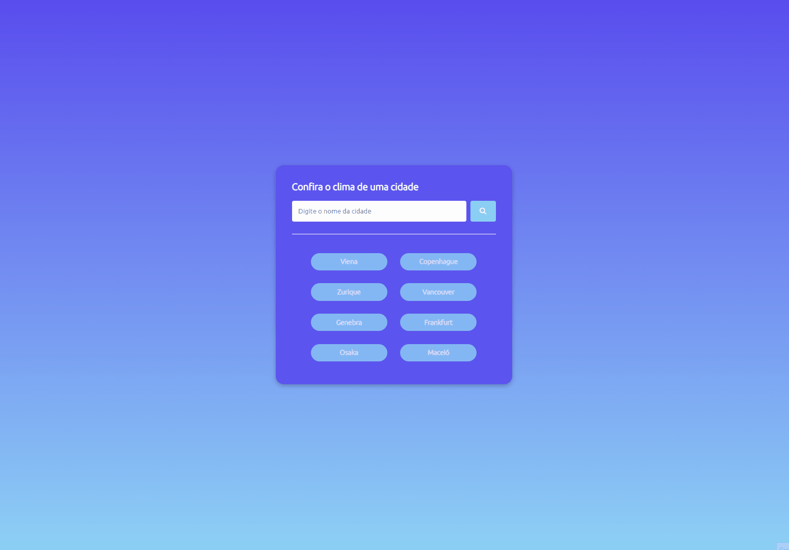
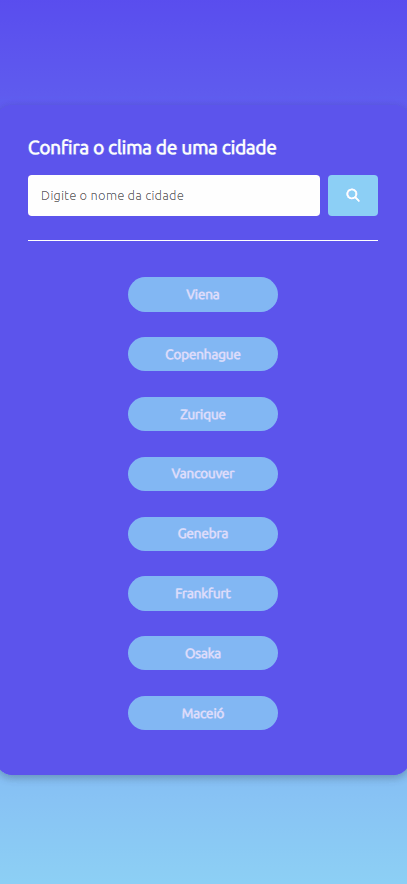

# Clima Tempo OpenWeather API 🌡️ 

🗺️🧭 Projeto que mostra clima tempo de qualquer cidade do mundo. Consumindo diversas API's de sites como: country flags, unsplash e open weather que contém informações e imagens de bandeiras, wallpapers e temperatura de cada cidade ou pais solicitado renderizando todo conteúdo unificado assim que solicitado. 🗺️🧭
#
* Deploy Netlify ☁️:
  * [Clima Tempo Atualizado](https://climatempo-bn.netlify.app/) 🌡️ 
#

* API's Manupuladas no Projeto 🌐:
    * [x] Primeiro passo faça cadastro no site OpenWeather para conseguir uma API e por lá você também pode conferir a documentação da API:
        * [Open Weather](https://openweathermap.org/) 🌡️ 
    * [x] Site da Api para coletar a bamdeira do país:
      * [Country Flags Api](https://flagsapi.com) 🗺️
    * [x] Site da Api para coletar wallpapers confome cidade solicitada na requisição:
       * [Source Unsplash](https://source.unsplash.com) 🧭    
#

* Stacks 📚 and Skills 🧠:
    * HTML
        * Tags Semânticas
        * Crossorigin __**Links API's Externos**__
        * Bibliotécas Externas __**fonts e icons**__:
            * [Google Fontes](https://fonts.googleapis.com)
            * [Font-Awesome](https://cdnjs.cloudflare.com/ajax/libs/font-awesome/6.2.0/css/all.min.css)
    * CSS
        * Flex-Box
        * Media Query
        * Linear-Gradient
    *  JavaScript 
        * DOM
        * Eventos
        * Funções
        * Fetch    
#

<h3>Page 📑:</h3>
<h4>Weather Cards 🎴🌡️🗺️🧭:</h3>

#

<h3>Responsive Mobile📲:</h3>
<h4>Weather Cards 🎴🌡️🗺️🧭:</h3>

#
